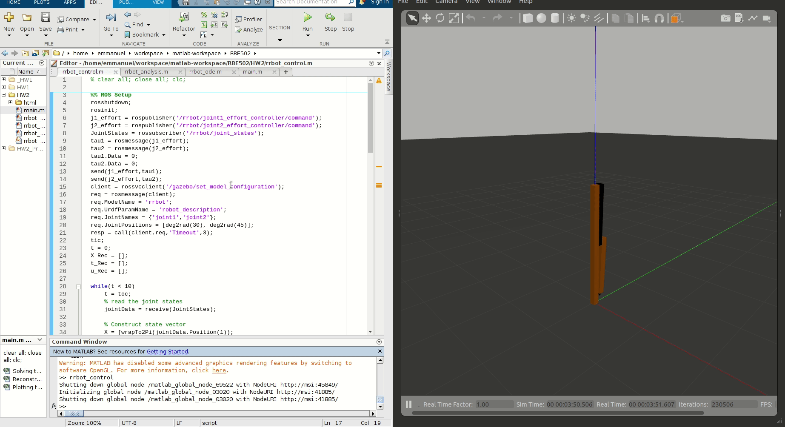
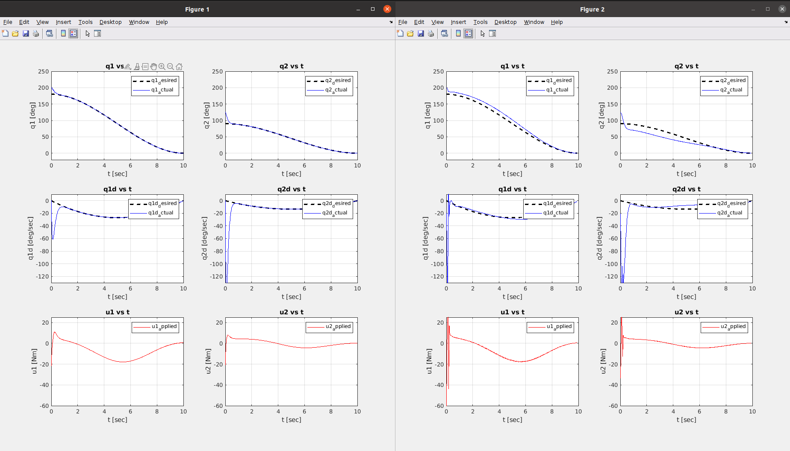

# Feedback-linearized Controller for Trajectory Tracking of rrbot

## Overview
The rrbot is modelled in MATLAB. Using state-space representation, various analysis like the Stablity test, Controllability test, Obsevability test were done. Further, a state-feedback controller was designed to move the robot from an initial condition of 30 degrees to 0 degrees (i.e. an upright position) as shown in the demo. 

> :information_source: The control algorithm is running on MATLAB and through ROS Toolbox, the commands are sent to the Gazebo simulator to control the rrbot.

---
## Demo
<p float="left">
  
</p>

---


## Plots & Analysis

The plot on the LHS in Figure 1 denotes the system response in MATLAB simulation.
The plot on the RHS in Figure 2 denotes the system response in Gazebo Physics Engine.
The simlarity in the plots shows the design done on MATLAB works well in practice in a physics engine too.


<p float="left">
  
</p>


---
<!--
---
## High Level View

<p float="left">
  
</p>


---
## Building

To build from source, clone the latest version from this repository into your catkin workspace and compile the package using

	```bash
	$ cd catkin_workspace/src
	$ git clone https://github.com/emmanuel-logy/motion_planning_algorithms.git
	$ cd ..
	$ catkin_make
	```


---
## Usage

Yet to add . . . 
	
	
---
    
    
---
## For further explanation

Please refer to the docs/Emmanuel_Report.pdf for more detailed explanation
	
	
---
-->
